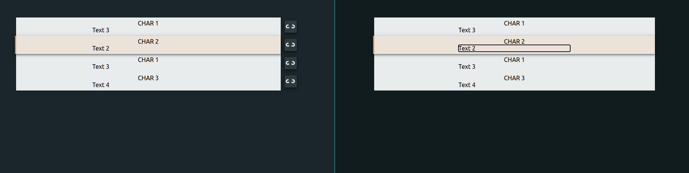

# Vite + Vue 3 + TS editor 

The project is a simple editor based on a pre-existing static JSON data.

[Demo](https://cnotv-vite-vue-editor-2021.netlify.app/)
[Design](https://www.figma.com/file/wg830mRe3fCMeOqGZJXWrd/Front-End-Dev-Interview-Task?node-id=0%3A1)

- [Stack](#stack)
- [Tasks](#tasks)
- [Feedback](#feedback)
  - [Project state](#project-state)
  - [Time](#time)
  - [Complexity](#complexity)
- [Recommended IDE Setup](#recommended-ide-setup)
  - [If Using `<script setup>`](#if-using-script-setup)
- [Type Support For `.vue` Imports in TS](#type-support-for-vue-imports-in-ts)
  - [If Using Volar](#if-using-volar)
  - [If Using Vetur](#if-using-vetur)

## Stack

The project is based on Vue 3 (using functional components), bundled with Vite and typed with Typescript.

The choice is done due founder goal for the future use, so it's meant to not be refactored in the very near future.

## Tasks

- Left: 
  - [x] All blocks have read-only fields
  - [x] There is an icon right of each block, clicking it will remove the block from the view, and stack the blocks again.
- Right:
  - [x] All fields of all blocks are editable. The user can left click inside any field of any block and edit its contents.
  - [x] Mouse clicking inside the area of a block (including the text fields) results in highlighting the block. Only one block can be highlighted at any moment.

- Extras:
  - [x] Removing a block from the left view, results in removing the corresponding block from the right view.
  - [x] Edit the contents of a field in a block in the right view results in updating the corresponding field in the left view.
  - [x] Optionally highlighting a block in the right view results in highlighting the corresponding block in the left view (This should be controlled by a flag that’s easy to set in the code or by any visual element of choice. E.g.: a check box).

## Feedback

### Project state

Beside completing all the tasks, the project has some Typescript issues for the AoT on build. Tests are also incorrectly configured, but a sample test has been also provided.

The use of Vuex as state management has not been introduced, given the triviality of the task and also to show simpler component communication, as it may be done in smaller abstracted modules.

### Time

The whole task has been taking roughly **6h** of time.

Most of the initial development has been done mainly in the initial **2-3 hours**.

The remaining part has been spent half with a refactoring and bidirectional binding of the input/buttons to the data. The other half has been spent in setup configuration, which has however been left incomplete for a matter of time.

### Complexity

To return back to a Vue.js project has been admittedly taking me some time, still not too much, as I also have already existing project which I could have been checking out.

The setup issue, however, has been some more challenging due the introduction of different tools without a pre-existing working configuration.

The last complication has been due the issues with the type, as I must admit to be quite different from what I am used to in React and Angular.

## Recommended IDE Setup

*(From the template)*

[VSCode](https://code.visualstudio.com/) + [Vetur](https://marketplace.visualstudio.com/items?itemName=octref.vetur). Make sure to enable `vetur.experimental.templateInterpolationService` in settings!

### If Using `<script setup>`

[`<script setup>`](https://github.com/vuejs/rfcs/pull/227) is a feature that is currently in RFC stage. To get proper IDE support for the syntax, use [Volar](https://marketplace.visualstudio.com/items?itemName=johnsoncodehk.volar) instead of Vetur (and disable Vetur).

## Type Support For `.vue` Imports in TS

Since TypeScript cannot handle type information for `.vue` imports, they are shimmed to be a generic Vue component type by default. In most cases this is fine if you don't really care about component prop types outside of templates. However, if you wish to get actual prop types in `.vue` imports (for example to get props validation when using manual `h(...)` calls), you can use the following:

### If Using Volar

Run `Volar: Switch TS Plugin on/off` from VSCode command palette.

### If Using Vetur

1. Install and add `@vuedx/typescript-plugin-vue` to the [plugins section](https://www.typescriptlang.org/tsconfig#plugins) in `tsconfig.json`
2. Delete `src/shims-vue.d.ts` as it is no longer needed to provide module info to Typescript
3. Open `src/main.ts` in VSCode
4. Open the VSCode command palette
5. Search and run "Select TypeScript version" -> "Use workspace version"
